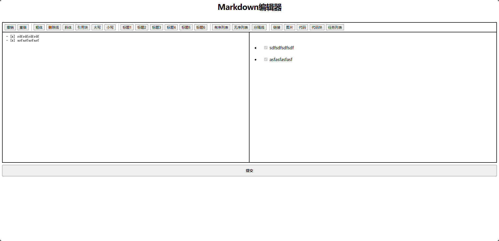

# flask-marked-sample
这是一个基于marked.js实现的可在Flask中运行的markdown编辑器。注意这并不是一个标准的Flask插件，而是模仿Flask插件写的python包。

本文使用或者参考了以下库：
* [JQuery](https://jquery.com/) 在[marked_scripts.html](flask_marked/templates/marked/marked_scripts.html)中链接了CDN中的文件。
* [marked.js](https://github.com/markedjs/marked) 在[marked_scripts.html](flask_marked/templates/marked/marked_scripts.html)中链接了CDN中的文件。
* [marked-highlight](https://github.com/markedjs/marked-highlight) 为`marked`的高亮显示插件，作为`marked`和`highlight.js`的桥梁。由于源代码不能直接被HTML使用，因此改写了一丢丢代码后，作为[highlight.js](flask_marked/static/js/marked/highlight.js)直接被本库所调用，请注意此文件遵循MIT许可。
* [highlight.js](https://highlightjs.org/)为代码块的高亮代码可以支持多种代码形式和提供多种代码高亮样式。在[marked_scripts.html](flask_marked/templates/marked/marked_scripts.html)中链接了CND中的文件。样式css文件在[marked_styles.html](flask_marked/templates/marked/marked_styles.html)中链接了CDN中的文件。

## 什么是marked？
*A markdown parser and compiler. Built for speed.*

Markdown 解析器和编译器。专为速度而打造。

*⚡ built for speed*

⚡ 为速度而生

*⬇️ low-level compiler for parsing markdown without caching or blocking for long periods of time*

⬇️ 低级编译器，用于解析 markdown，无需缓存或长时间阻塞

*⚖️ light-weight while implementing all markdown features from the supported flavors & specifications*

⚖️ 轻量级，同时实现支持的口味和规格的所有 Markdown 功能

*🌐 works in a browser, on a server, or from a command line interface (CLI)*

🌐 可在浏览器、服务器或命令行界面 (CLI) 中工作

## 安装

### 下载
```bash
https://github.com/jdiaan/flask-marked-sample.git
```
将其中的`flask_marked`文件放入你的python环境中。

### 依赖

#### 需要手动安装的依赖
* Flask的安装
```bash
pip install Flask
```
* 本库中的`form`表单是由`flask_wtf`实现的，如果你使用本库中的`form`的话需要安装：
```bash
pip install Flask-WTF
```

#### 不需要手动安装的依赖
* 由于本人所写的`JavaScript`是基于[JQuery](https://jquery.com/)所写的，因此在[marked_scripts.html](flask_marked/templates/marked/marked.html)中含有CDN的超链接`https://code.jquery.com/jquery-3.7.1.slim.min.js`。
* 由于本库是基于[marked.js](https://github.com/markedjs/marked)实现的，因此在[marked_scripts.html](flask_marked/templates/marked/marked.html)中含有CDN的超链接`https://cdn.jsdelivr.net/npm/marked/marked.min.js`。
* 由于本库使用了marked插件`marked-highlight`，由于插件没有直接提供可供HTML直接使用的js文件，因此修改了源代码作为[highlight.js](flask_marked/static/js/marked/highlight.js)直接被本库所调用，请注意此文件遵循MIT许可。
* 由于代码块的高亮实现使用了[highlight.js](https://highlightjs.org/)，因此在[marked_scripts.html](flask_marked/templates/marked/marked.html)中含有CDN的超链接`https://cdnjs.cloudflare.com/ajax/libs/highlight.js/11.9.0/highlight.min.js`,在[marked_styles.html](flask_marked/templates/marked/marked_styles.html)中含有CDN的超链接`<link rel="stylesheet" href="https://cdnjs.cloudflare.com/ajax/libs/highlight.js/11.9.0/styles/{{ highlight_type }}.min.css">`注意此代码无法直接使用。

## 示例

如果你不想要完全自定义代码：
```python
from flask import Flask, render_template
from flask_marked import MarkedForm
from flask_marked import Marked

app = Flask(__name__)
app.config["SECRET_KEY"] = "secret"
marked = Marked(app)


@app.route("/", methods=["GET", "POST"])
def index():
    form = MarkedForm()
    if form.validate_on_submit():
        text = form.pagedown.data
        form.text.data = "提交成功！"

    return render_template("marked/index.html", form=form)


if __name__ == "__main__":
    app.run(debug=True)

```



还可以强的自定义的HTML，[index.html](flask_marked/templates/marked/index.html)：
```html
<html lang="zh-CN">

<head>
    <meta charset="utf-8">
    <meta name="viewport" content="width=device-width, initial-scale=1.0">

    <title>TEST</title>

    
</head>

<body>
    
    <form action="" method="POST" class="marked-form">
        {{ form.hidden_tag() }}
        <div class="marked-input-wrap">
            
            
        </div>
        <button id="{{ form.submit.id }}" type="submit" value="{{ form.submit.label.text }}" class="marked-form-button">{{ form.submit.label.text }}</button>
    </form>

    
</body>
```

## 自定义
本库提供非常大的自定义空间。

### 自定义HTML
你可以使用FLask中自订的jinja2语句来实现扩展，你可以随心所欲的插入到自己的HTML文件中：
```html



...
```
以下是各个可调用的HTML文件说明：
| 文件                | 说明                   | 调用                                                              |
| :------------------ | :--------------------- | :---------------------------------------------------------------- |
| index.html          | 包含网页中最基础的代码 | 推荐直接路由返回`render_template("marked/index.html", form=form)` |
| marked.html         | 包含所有控件的代码     |                                 |
| marked_scripts.html | 只包含脚本调用         |                         |
| marked_styles.html  | 只包含样式调用         |                          |
| marked_title.html   | 只包含标题控件         |                           |
| marked_toolbar.html | 只包含功能按钮控件     |                         |
| marked_form.html    | 只包含form控件         |                            |
| marked_input.html   | 只包含textarea控件     |                           |
| marked_preview.html | 只包含预览控件         |                         |

因此当你的HTML文件需要比较复杂时，可以自行插入指定的调用代码来实现更加多样的功能。

### 自定义script文件调用
你可能并不需要库中所提供的CND链接来加载特定的脚本文件，你可以在Flask中配置`MARKED_FILTER_SCRIPTS`的选项来修改指定文件是否被自动调用，[请查看配置](#配置)。如果你不想要所提供的`jquery`代码，你可以配置(只是其中一种做法)：
```python 
app = Flask(__name__, instance_relative_config=True)
app.config.from_mapping(
    MARKED_FILTER_SCRIPTS=["jquery"],
)
```
此时将不再将jquery的脚本自动导入进HTML中了，但是由于本库的js文件是基于jquery所写的，如果不导入程序将会出错，你可以自行修改源代码变为原生`js`脚本，或者在你的HTML文件中手动添加以下代码：
```html
<script type="text/javascript" src="{{ url_for('_marked.static', filename='你的路径/jquery.js') }}"></script>
```
好的，这样你就可以随心所欲修改需要使用的js脚本了。

### 自定义css文件的调用
使用方法和大致和script文件调用一样，你可以在Flask中配置`MARKED_FILTER_HIGHLIGHT_CSS`的选项来修改css文件是否被自动调用，[请查看配置](#配置)。如果你不想要所提供的`highlight`的css，你可以配置(只是其中一种做法)：
```python 
app = Flask(__name__, instance_relative_config=True)
app.config.from_mapping(
    MARKED_FILTER_CSS=["highlight"],
)
```
当然你还得手动添加代码，来使代码块高亮显示：
```html
<link rel="stylesheet" href="{{ url_for('_marked.static', filename='你的路径/styles.css') }}">
```
现在，你就可以随心所欲修改调用的css文件了。

### 自定义css样式
#### 代码块的样式
  
代码块的样式是使用了`highlight.js`的css文件，如果你需要修改显示的样式首先请在[highlight.js](https://highlightjs.org/demo)预览样式，然后获取Theme的名称，并添加或修改配置属性`MARKED_HIGHLIGHT_TYPE`的值即可。比如我喜欢"atom-one-dark"这个样式，你可以配置(只是其中一种做法)：
```python
app = Flask(__name__, instance_relative_config=True)
app.config.from_mapping(
    MARKED_HIGHLIGHT_TYPE="atom-one-dark",
)
```
这样你就可以在很多种css配置中选择你喜欢的样式了。

#### 控件的样式
我为绝大多是HTML的控件中添加了class属性，请自行查阅浏览器中的HTML代码或者[styles.css](flask_marked/static/css/marked/styles.css)。同样的不需要导入我的css文件可以见代码块的样式或者[配置](#配置)

### 自定义控件

#### 自定义本库的html文件代码
你可以在你的Flask主templates文件夹中新建`marked`文件夹，并在里面添加新的但是名称与本库提供的HTML文件相同命名的文件，比如我需要修改本库的`marked_toolbar.html`的文件，你就可以在你的Flask主templates文件夹中添加`templates\marked\marked_toolbar.html`文件，这时候Flask会优先调用此新文件。

#### 功能按钮的实现

如果需要本库js文件来监控功能按钮是否被点击，需要将按钮放入`class="marked-toolbar"`的元素中。`button`中的`value为`触发相应功能的key，如果你创建了一个新的按钮，将`value`的值改为`undo`那么这个按钮点击时就会触发undo的功能。具体有哪些key可以参阅文件[markedEditer.js](flask_marked/static/js/marked/markedEditer.js)，你也可以自行修改代码，来增加更多的功能。
```html
<div class="marked-toolbar">
    <div class="toolbar-button-wrap">
        <button type="button" class="toolbar-button" title="撤销" value="undo">撤销 </button>
    </div>
</div>   
```

#### 快捷键的实现

本库只用了几个快捷键功能，请自行查阅文件[markedEditer.js](flask_marked/static/js/marked/markedEditer.js)中缩进功能的快捷键实现：
```js
if (event.which === 9) {
    let newSel;  // 新的选择范围
    event.preventDefault();
    if (event.shiftKey) {
        newSel = buttonEvent($inputTextarea, 'leftIndent');
    } else {
        newSel = buttonEvent($inputTextarea, 'rightIndent');
    }
    updataHtml();
    $inputTextarea.setCaretPosition(newSel.newSelStartPos, newSel.newSelEndPos);
    writeHistory();
}
```

## 配置
请自行在Flask提供的方法中配置。

| 配置名                | 类型 | 默认值        | 说明                          | 可选择的值                                                       |
| :-------------------- | :--- | :------------ | :---------------------------- | :--------------------------------------------------------------- |
| MARKED_BP_NAME        | str  | `"_marked"`   | 蓝图的名称                    | -                                                                |
| MARKED_BP_URL_PREFIX  | str  | `"/marked"`   | 蓝图的URL前缀                 | -                                                                |
| MARKED_FILTER_SCRIPTS | list | `[]`          | 需要过虑script的文件列表      | `"jquery"`, `"marked"`, `"highlight"`                            |
| MARKED_FILTER_CSS     | list | `[]`          | 需要过虑css的文件列表         | `"highlight"`, `"style"`-                                        |
| MARKED_HIGHLIGHT_TYPE | str  | `github-dark` | highlight.js的高亮类型css文件 | 请查阅[highlight.js](https://highlightjs.org/demo) 中的Theme选项 |